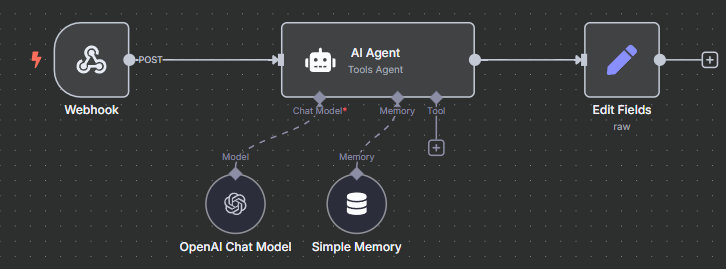

# FURIA Chat - Aplicação de Chat com Inteligência Artificial

Este projeto é uma aplicação de chat personalizada para a FURIA que utiliza inteligência artificial através do n8n para interagir com os usuários.

## Tecnologias Utilizadas

### Frontend
- **[Next.js](https://nextjs.org/)** 
- **[React](https://reactjs.org/)** 
- **[TypeScript](https://www.typescriptlang.org/)**
- **[Shadcn UI](https://ui.shadcn.com/)**
- **[Tailwind CSS](https://tailwindcss.com/)**

### Backend
- **[n8n](https://n8n.io/)**
  - AI Agent(GPT 4o mini)
  



## Funcionalidades

- Interface de chat amigável e responsiva personalizada para FURIA
- Tema claro/escuro com alternância automática
- Integração com n8n para processamento de mensagens via IA
- Histórico de chat persistente por usuário (via Redis no n8n)
- Indicador de digitação durante o carregamento de respostas

## Estrutura do Projeto

```
src/
  app/               # Estrutura de rotas do Next.js
    api/             # Rotas de API
      routes/        # Endpoint da API de chat para comunicação com n8n
    globals.css      # Estilos globais e temas
    layout.tsx       # Layout principal
    page.tsx         # Página inicial
  components/        # Componentes React
    chat/            # Componentes modulares do chat
      Chat.tsx       # Componente principal de chat (orquestrador)
      ChatMessage.tsx # Componente para renderizar mensagens individuais
      ChatTypingIndicator.tsx # Indicador de digitação do bot
      types.ts       # Definições de tipos para o chat
      useChatMessages.ts # Hook customizado para estado e comunicação API
    ui/              # Componentes de UI (shadcn)
  lib/               # Utilitários e helpers
```

## Configuração do n8n

O projeto utiliza um workflow no n8n com os seguintes componentes:

- Webhook para receber mensagens do frontend
- AI Agent para processamento de mensagens
- Redis Chat Memory para histórico de conversas por sessionId (opcional)

É necessário ativar o fluxo de trabalho no n8n e configurar corretamente a URL do webhook no arquivo de ambiente.

## Como rodar o projeto?

Primeiro, instale as dependências:

```bash
npm install
# ou
yarn install
# ou
pnpm install
```

Depois, configure as variáveis de ambiente criando um arquivo `.env.local` na raiz do projeto:

```
N8N_WEBHOOK_URL=sua-url-do-webhook-n8n
```

Em seguida, execute o servidor de desenvolvimento:

```bash
npm run dev
# ou
yarn dev
# ou
pnpm dev
# ou
bun dev
```

## Aprendendo Mais

Para saber mais sobre as tecnologias utilizadas:

- [Documentação do Next.js](https://nextjs.org/docs)
- [Documentação do React](https://reactjs.org/docs)
- [Documentação do Tailwind CSS](https://tailwindcss.com/docs)
- [Documentação do Shadcn UI](https://ui.shadcn.com/docs)
- [Documentação do n8n](https://docs.n8n.io/)